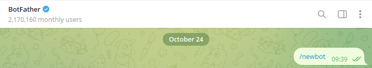
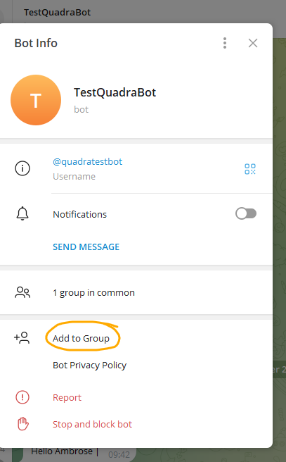

# How to Generate a Token for Your Bot
## Talk to BotFather:

1. Open the Telegram app and search for `@BotFather`, or simply go to t.me/BotFather.
Start a chat with BotFather and use the command `/newbot` to create a new bot.

2. Name Your Bot:

3. BotFather will ask you to choose a name and a username for your bot. The name can be anything,
but the username must be unique and end with bot.

4. Get the Token:

5. After completing the setup, BotFather will give you an API Token.
This token is a long string of characters, something like: 123456789:ABC-DEF1234ghIkl-zyx57W2v1u123ew11.

6. Make the group chat, and invite your bot to the group.

